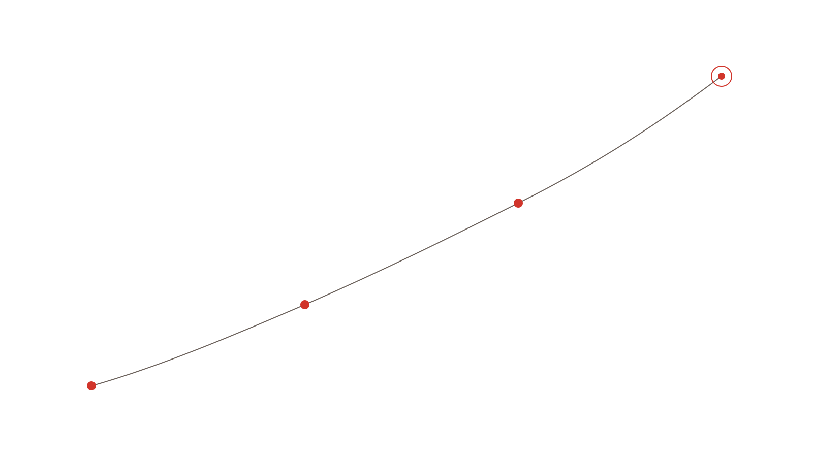
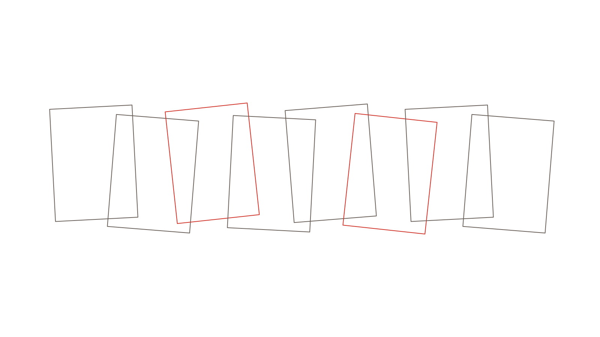
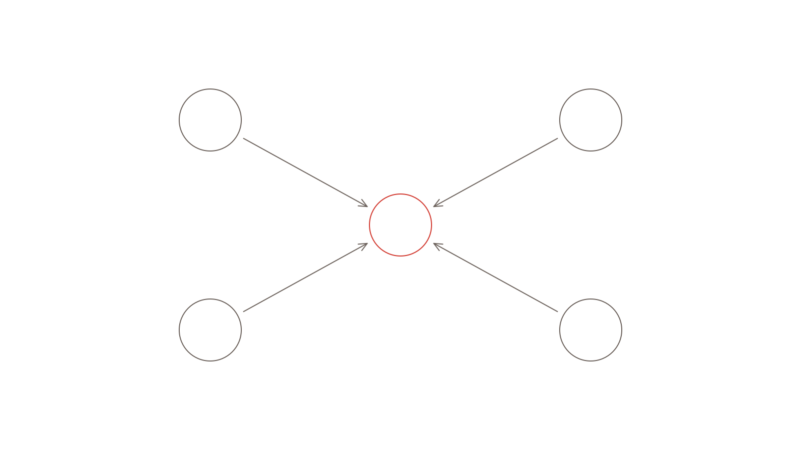

::: {.hero}

::: {.eyebrow}
Lộ trình
:::

# Năm chặng, và sau mỗi chặng bạn có một sản phẩm nộp được

::: {.lede}
Điều làm nhiều bạn nản lòng thường không phải khối lượng công việc, mà là không biết mình còn cách đích bao xa. Lộ trình này chia bốn năm thành năm đoạn, mỗi giai đoạn kết thúc bằng một sản phẩm cụ thể để bạn nhìn thấy mình vừa đi được bao nhiêu, làm được những gì.
:::

:::

{.illus fig-alt="Đường cong đi lên với bốn điểm dừng"}

## Lộ trình này dành cho ai

Các chặng dưới đây bám theo chương trình đào tạo tiến sĩ bằng tiếng Việt tại các trường trong nước: chuyên đề tổng quan, chuyên đề 1, chuyên đề 2, rồi toàn bộ quyển luận án. Đây là hệ thống mình đang học và nắm rõ từng mốc thời gian.

Nếu chương trình của bạn viết bằng tiếng Anh, hoặc theo mẫu ghép các bài báo đã đăng thành từng chương như nhiều đại học nước ngoài, thì phần cấu trúc quyển sẽ khác biệt khá nhiều. Mình chưa có kinh nghiệm ở dạng đó, nhưng mình quen một mentor làm được và sẵn sàng giới thiệu bạn với người ấy. Không mất phí, và cũng chẳng có hoa hồng giới thiệu nào cả. Bạn cứ nhắn cho mình 🙂

## Cách đọc lộ trình

Bạn không bắt buộc phải đi cả năm chặng cùng mình. Nếu bạn đang ở giữa chặng ba thì đi chặng ba thôi, không ai bắt bạn trả tiền cho hai chặng đã qua.

Mỗi chặng khép lại bằng một sản phẩm nộp được, trong đó chắc chắn sẽ có quyển chuyên đề với bố cục chuẩn, hoặc thêm vào nữa là một bài báo đăng tạp chí. Đây là chỗ khác biệt giữa việc học thêm kiến thức và việc đi hết một quãng đường: cuối chặng bạn có thứ cầm đi nộp, chứ không phải một cảm giác đã hiểu rồi về nhà mới thực hành. Mình thích phong cách thực chiến, học qua sản phẩm hơn.

::: {.note}
**Về bài báo khoa học.** Lộ trình hướng tới hai bài Scopus và một bài trong nước từ 0,75 điểm. Nhưng việc một bản thảo có được nhận đăng hay không thì ban biên tập và người phản biện quyết định, không phải mình, cũng không phải bạn. Điều mình hỗ trợ bạn được là làm cho bản thảo đủ chuẩn để nộp, và khi phản biện gửi về thì bạn biết cách trả lời chứ không hoảng hốt.
:::

## G0 · Đề cương nghiên cứu thi đầu vào {#g0}

::: {.stage}
[Chặng 0]{.stage-code}

### Từ một mối quan tâm còn mơ hồ thành đề cương nộp được

Dành cho bạn đang chuẩn bị hồ sơ dự tuyển. Chặng này ngắn nhất nhưng ảnh hưởng lâu dài nhất, vì một đề tài chọn sai ở đây sẽ theo bạn suốt mấy năm sau.

- Nghe bạn kể mối quan tâm ban đầu, rồi cùng xem nó có đủ chất liệu để làm mấy năm không
- Tìm khoảng trống nghiên cứu có thật, chứ không phải khoảng trống do mình chưa đọc kỹ mà tưởng nhầm
- Đặt câu hỏi nghiên cứu ở mức trả lời được bằng dữ liệu thu thập được ở Việt Nam
- Chọn lý thuyết nền, và giải thích được vì sao chọn lý thuyết đó
- Phác thảo phương pháp, thử xem dữ liệu có thu thập được không, trước khi bạn quyết định chính thức chọn đề tài
- Rà soát lại cấu trúc và văn phong theo đúng biểu mẫu của trường bạn nộp

[**Cuối chặng bạn có:** đề cương nghiên cứu nộp hồ sơ dự tuyển. Bốn buổi, mỗi buổi 90 phút, trải trong bốn tới sáu tuần.]{.stage-out}
:::

## G1 · Chuyên đề tổng quan {#g1}

::: {.stage}
[Chặng 1]{.stage-code}

### Đọc có hệ thống thay vì đọc lan man

Chặng này để lại cho bạn một kỹ năng sử dụng được lâu dài chứ không chỉ dùng cho một chuyên đề. Bạn đọc có hệ thống thì viết tổng quan trong sáu tuần. Đọc lan man thì sáu tháng vẫn bị góp ý là mới liệt kê chứ chưa lập luận.

- Xây dựng chiến lược tìm kiếm trên Scopus và Web of Science: từ khoá, chuỗi truy vấn, tiêu chí lựa chọn và loại trừ
- Quy trình PRISMA 2020 để việc lựa chọn tài liệu minh bạch và lặp lại được
- Khung TCCM để đọc và phân loại tài liệu có hệ thống
- Sử dụng Zotero để không thất lạc nguồn và xuất trích dẫn tự động
- Trắc lượng thư mục bằng VOSviewer hoặc Bibliometrix trên R, nếu phù hợp với đề tài của bạn (nhưng mình không khuyến khích phương pháp này)
- Viết tổng quan có lập luận, có khoảng trống nghiên cứu được chỉ ra rõ ràng
- Biên tập phần tổng quan thành một bản thảo bài báo hoàn chỉnh

[**Cuối chặng bạn có:** chuyên đề tổng quan và một bản thảo bài báo. Tám buổi.]{.stage-out}
:::

{.illus fig-alt="Nhiều tấm giấy xếp chồng lệch nhau, vài tấm được tô đỏ"}

## G2 · Cơ sở lý thuyết và xây dựng mô hình nghiên cứu {#g2}

::: {.stage}
[Chặng 2]{.stage-code}

### Mô hình được tạo ra bởi lý thuyết nền, không phải từ việc sao chép, chồng ghép những mô hình có sẵn

Đây là chỗ hội đồng sẽ hỏi nhiều nhất. Câu bạn sẽ bị hỏi không phải mô hình của bạn gồm những gì, mà vì sao lại là biến này chứ không phải biến kia. Mối tương quan này lấy từ nguồn nào, luận cứ có đủ vững chắc hay không?

- Chọn và bảo vệ lý thuyết nền. Nhóm lý thuyết mình làm việc thường xuyên gồm Stimulus-Organism-Response, Job Demands-Resources, Conservation of Resources, Technology Acceptance Model, Self-Determination Theory, Social Cognitive Career Theory, Person-Environment Fit và Place Attachment
- Xây dựng mô hình nghiên cứu, và đảm bảo mô hình được sinh ra từ lý thuyết nền
- Phát biểu giả thuyết đúng chuẩn, mỗi giả thuyết có lập luận lý thuyết đi kèm
- Hướng dẫn xử lý biến trung gian, biến điều tiết, mô hình bậc cao
- Vẽ sơ đồ đường dẫn đúng quy ước
- Tập trả lời trước những câu hội đồng thường hỏi
- Biên tập phần này thành một bản thảo bài quốc tế theo hướng định tính, hướng tới nhóm tạp chí Q3

[**Cuối chặng bạn có:** chuyên đề 1 và một bản thảo bài quốc tế. Mười buổi.]{.stage-out}
:::

{.illus fig-alt="Các hình tròn rỗng nối nhau bằng mũi tên"}

## G3 · Phương pháp nghiên cứu và kết quả nghiên cứu {#g3}

::: {.stage}
[Chặng 3]{.stage-code}

### Chạy được số liệu là một chuyện, diễn giải đúng số liệu là chuyện khác

Chặng dài nhất và nặng nề nhất. Nhiều bạn dừng lại ở đây vì dữ liệu thu về không sử dụng được, mà nguyên nhân thường nằm ở bảng hỏi đã được thiết kế chưa chuẩn từ sáu tháng trước đó.

- Thiết kế nghiên cứu và chọn phương pháp phù hợp với câu hỏi, chứ không chọn theo thói quen hoặc những công trình luận án trước đó đã làm và bắt chước theo
- Xây dựng thang đo: kế thừa từ nguồn nào, điều chỉnh cho ngữ cảnh Việt Nam ra sao, quy trình dịch ngược
- Thiết kế bảng hỏi và biểu mẫu khảo sát trực tuyến, khảo sát thử trên mẫu nhỏ, điều chỉnh trước khi phát chính thức
- Chiến lược thu thập mẫu, cỡ mẫu tối thiểu, cách làm sạch dữ liệu và xử lý câu trả lời không hợp lệ
- Phân tích định lượng bằng PLS-SEM trên SmartPLS: mô hình đo lường, mô hình cấu trúc, tiếp cận hai giai đoạn, bootstrapping, kiểm định trung gian và điều tiết, kiểm định bất biến đo lường (hoặc xử lý số liệu theo phần mềm khác như SPSS, AMOS, fsQCA, hoặc Python)
- Phân tích định tính: reflexive thematic analysis, phỏng vấn sâu bán cấu trúc, xử lý trên NVivo (hoặc các phương pháp định tính khác. Với định tính mình sẽ hướng bạn tới Python nhiều hơn)
- Trình bày kết quả đủ những chỉ số mà người phản biện quốc tế thường hỏi tới
- Biên tập phần này thành một bản thảo bài quốc tế (thường là Q2/Q3)

[**Cuối chặng bạn có:** chuyên đề 2 và một bản thảo bài quốc tế. Mười hai buổi.]{.stage-out}
:::

## G4 · Hoàn thiện toàn bộ luận án {#g4}

::: {.stage}
[Chặng 4]{.stage-code}

### Ghép ba chuyên đề rời rạc thành một quyển đọc liền mạch

Ba chuyên đề viết cách nhau hai năm thường không khớp nhau: ký hiệu khác, tên biến khác, số liệu ở chương ba không trùng khớp chương bốn. Chặng này sẽ xử lý từng vấn đề đó.

- Phân bố cấu trúc quyển: chương nào chứa gì, dài bao nhiêu, nối vào nhau bằng đoạn nào
- Viết lại phần mở đầu và kết luận cho khớp với những gì bạn thật sự làm được
- Phần thảo luận: nối kết quả về lại lý thuyết, nêu hàm ý lý thuyết và hàm ý quản trị, thừa nhận hạn chế đúng cách
- Xử lý phụ lục: bảng hỏi, kết quả thô, danh sách chuyên gia, biên bản phỏng vấn
- Chuẩn hoá tài liệu tham khảo theo đúng kiểu trích dẫn trường bạn yêu cầu
- Rà soát tính nhất quán toàn quyển: ký hiệu, tên biến, số liệu giữa các chương
- Chuẩn bị bảo vệ: xây dựng slide, tập trả lời phản biện, tập trình bày đủ ý trong khung thời gian cho phép

[**Cuối chặng bạn có:** quyển luận án hoàn chỉnh. Mười buổi.]{.stage-out}
:::

## Đi kèm mọi chặng

| Hạng mục | Nội dung |
|---|---|
| Buổi nói chuyện đầu | 30 phút, không thu phí, qua Google Meet hoặc Messenger. Đủ để hai bên biết có phù hợp với nhau không |
| Lộ trình riêng của bạn | Sau buổi đầu, bạn nhận một lộ trình viết ra giấy: mốc nào làm gì, hạn nào, sản phẩm nào |
| Thư viện 100 bài | Danh mục 100 bài báo quốc tế mình tuyển chọn riêng cho đề tài của bạn, kèm ghi chú vì sao đáng đọc và nên đọc theo thứ tự nào, kèm hướng dẫn lấy bản toàn văn qua thư viện trường, các cơ sở dữ liệu truy cập mở, ResearchGate và cách viết thư xin bài từ chính tác giả. Mục dưới đây giải thích vì sao lại là con số 100 |
| Hỏi giữa các buổi | Mình trả lời trong 24 giờ làm việc, và đọc bản viết của bạn một lần mỗi tuần |
| Giữ nhịp tiến độ | Mình nhắc mốc tiến độ chủ động. Đây là phần nhiều bạn cần tới mà ít nơi cung cấp |
| Nói sớm khi lệch | Thấy bạn đi lệch là mình nói ngay, không đợi bạn làm xong mới nói |

: {tbl-colwidths="[26,74]"}

## Vì sao lại là 100 bài

Con số này không phải chọn cho tròn trịa. Khoảng một trăm bài là ngưỡng mà một đề tài bắt đầu có nền tảng riêng.

Với chừng đó bài đọc kỹ, bạn đủ nguồn để kế thừa và điều chỉnh thang đo cho ngữ cảnh Việt Nam, đủ mẫu để chạy một quy trình tổng quan có hệ thống, cho ra kết quả có ý nghĩa, đủ chất liệu để viết một bản tổng quan tự sự có lập luận, và đủ khối lượng tài liệu để tự xây dựng lấy một khung phân tích cho riêng đề tài của bạn thay vì mượn nguyên khung của người khác.

Đọc đúng và đọc đủ chừng đó thì khoảng trống nghiên cứu tự hiện ra. Bạn không còn phải ngồi đoán xem đề tài của mình có mới mẻ không. Đó chính là việc bạn cần làm xong ở chặng G1, và là chỗ nhiều bạn loay hoay lâu nhất chỉ vì đọc thiếu và đọc lệch.

::: {.hoa}
:::

## Chọn chặng của bạn

[Xem học phí từng chặng](hoc-phi.qmd){.cta}
[Hẹn mình 30 phút nói chuyện](lien-he.qmd){.cta-quiet}


